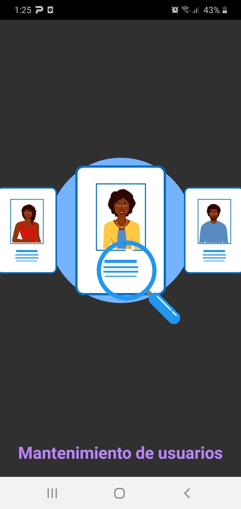
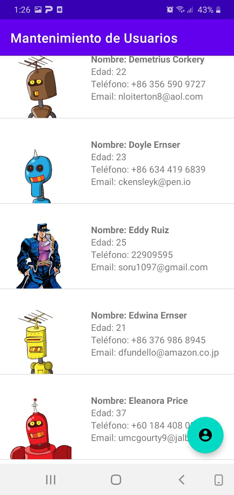
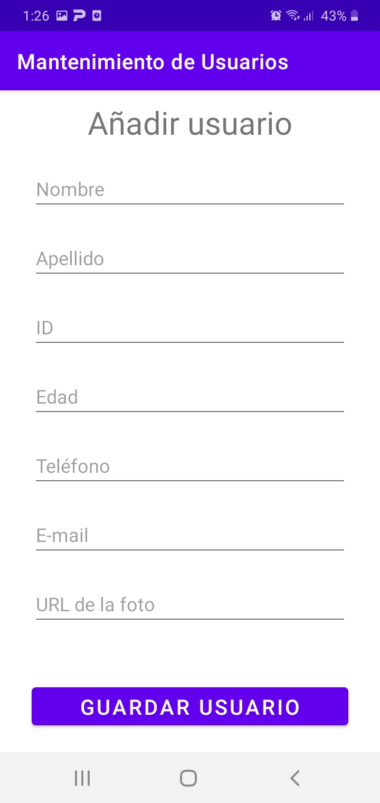

# Mantenimiento-Usuarios
Esta pequeña app es el resultado de realizar el Examen 2 del curso Desarrollo de aplicaciones móviles del 2do semestre 2022 de la Universidad de Costa Rica.

En esta app se utiliza:
- CRUD usando DAO Rooms como almacenamiento persistente.
- Consumo de API por medio de librería Volley.
- Uso de splash screen usando LottieAnimationView.

Screenshots:

